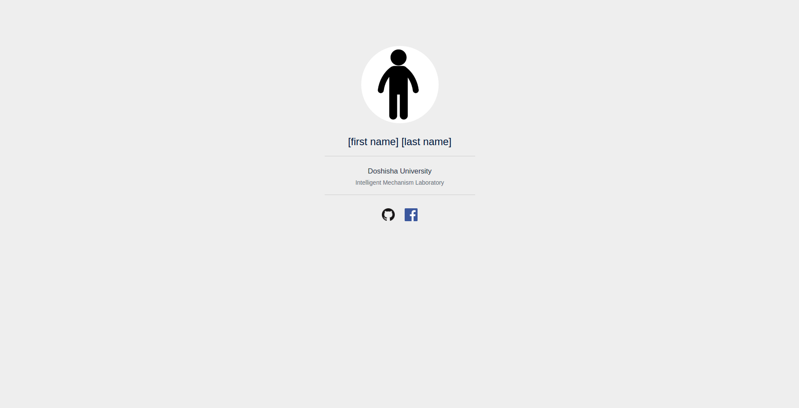
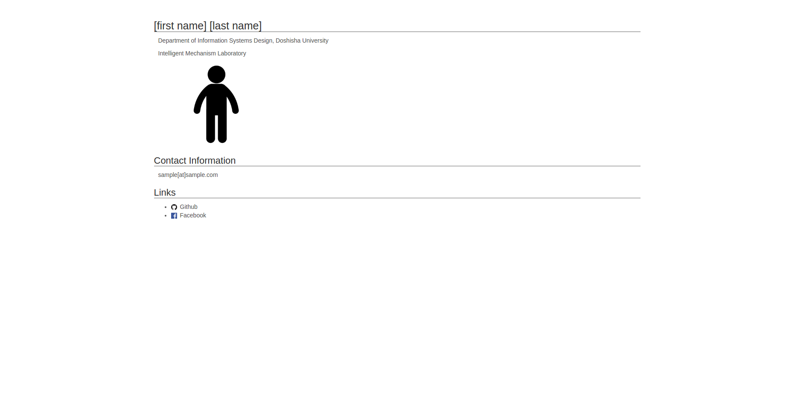
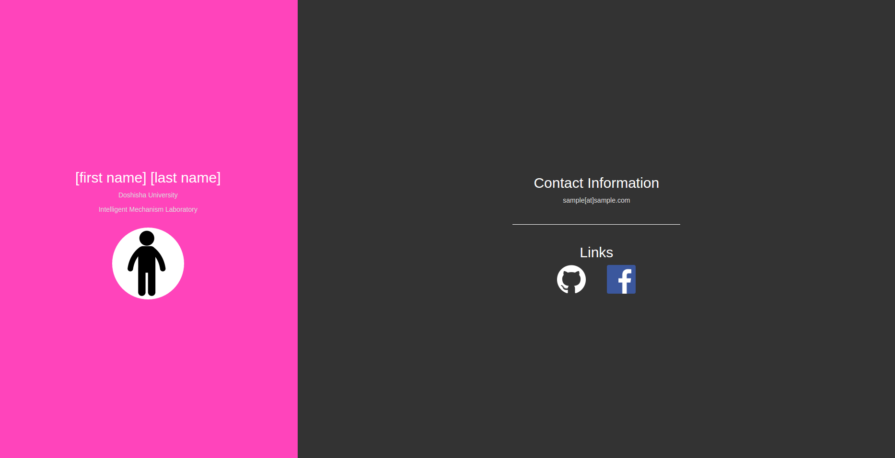

# Samples

## sample0



## sample1



## sample2




# Getting Started

## Git

### User Settings

```
$ git config --global user.name "Hirokazu Kiyomaru"
$ git config --global user.email "username@example.com"
```

### Initialize

```
$ git init
```

### Stage

```
$ git add <file pattern>
```

### Commit

```
$ git commit -m "Commit message"
```

### Check status

```
$ git status
```

### Check log

```
$ git log
```

### Check difference

```
$ git diff
```


## Create homepage

### Clone this repository

First, clone this repository and change directory.

```
$ git clone https://github.com/kiyomaro927/hp-practice.git
```

```
$ cd hp-practice/sample0
```

### Start up server

Then, start up a server with Python.

```
$ python -m SimpleHTTPServer
```

If you have Python3, this will go well.

```
$ python3 -m http.server
```

### Check

Get access to ```localhost:8000``` using your favorite browser, and make sure everything is ok.

### What's next?

As I was mentioned above, I prepared three sample pages(sample0/sample1/sample2).

I hope you'll make a wonderful Website based on them.

## Github

### Sign up

[Github](https://github.com/)

### Create repository

Repository name: __username.github.io__

### Push

```
$ git remote add origin https://github.com/username/username.github.io.git
$ git push -u origin master
```

### Check

Then, get access to ```http://username.github.io/```

Everyone around the world can show this page, so you have to make it cool!


